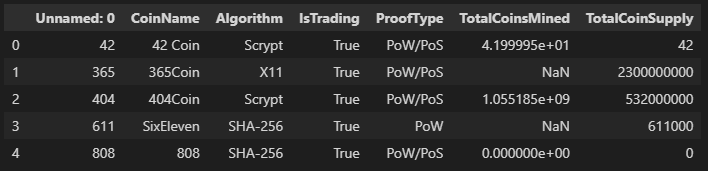

# Cryptocurrencies K-Means Analysis

This exercise attempts to group various crypto curriences using the K-Means clustering alogrithm.

## Raw Data

The original dataset had 7 columns. Several columns were dropped, categorical variables were one hot encoded, and numerical values were normalized.

## K Determination

Several K means models were run with varying K values. The interia and K values were plotted to create an elbow plot. The elbow plot suggests that 4 clusters is the ideal value for K.

## Scatter Plot

A 3D scatter plot idealy shows the clusters in 3D space. Below is a project onto 2D space.

